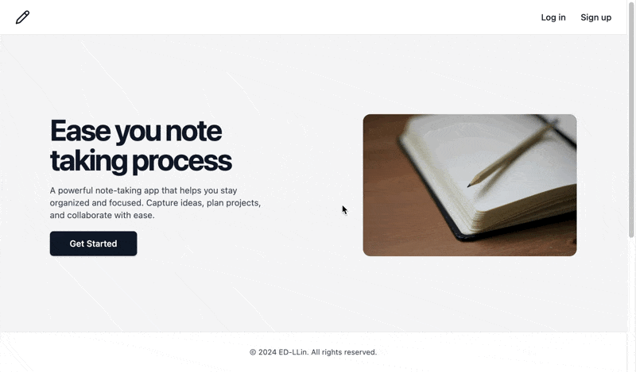
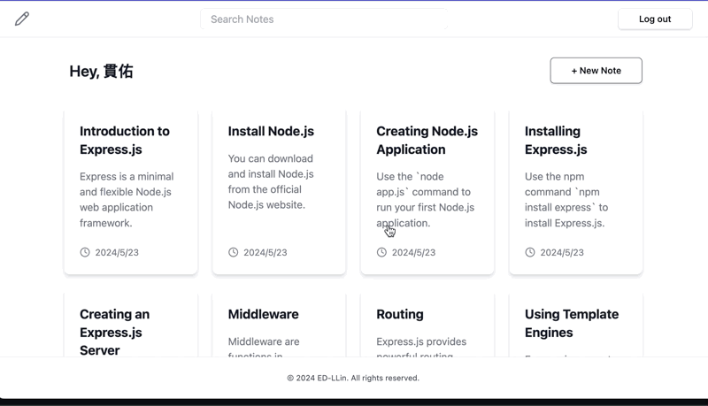
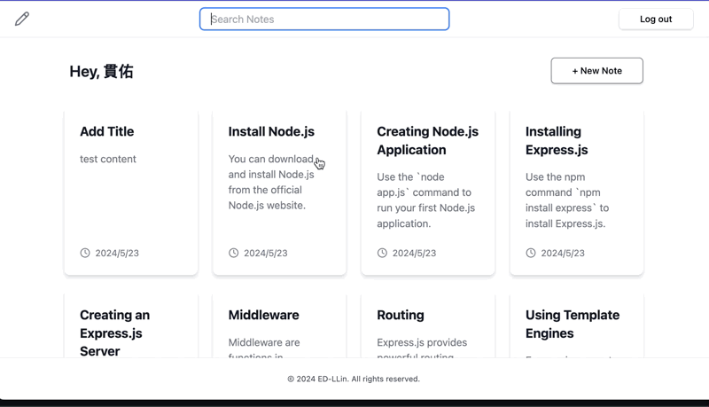

# Notion Clone Project

## Overview
A Notion-like application built with Node.js and Express. It provides a platform for note-taking.

## Features
### 1. User authentication and authorization

### 2. Create, read, update, and delete notes

### 3. Search functionality


## Requirements
- Node.js >= 14.0.0
- MongoDB

## Technologies Used
- Backend
    - Node.js
    - Express.js
    - method-override

- Frontend
    - EJS
    - TailwindCSS

- Database
    - MongoDB
    - Mongoose

- Authentication
    - Passport.js
    - express-session
    - MongoStore

- Configuration
    - dotenv

## Installation
1. Clone the repository:
   ```sh
   git clone https://github.com/yourusername/notion-clone-project.git
   cd notion-clone-project
   ```

2. Install dependencies:
   ```sh
   npm install
   ```

3. Create a `.env` file in the root directory and add the following:
   ```env
   PORT=3000
   MONGODB_URI=your_mongodb_uri
   SESSION_SECRET=your_session_secret
   ```

## Usage
1. Start the application:
   ```sh
   npm start
   ```

2. Open your browser and navigate to `http://localhost:3000`.

## API Documentation
This project includes Swagger API documentation. To access the API docs, navigate to `http://localhost:3000/api-docs` in your browser. The documentation provides detailed information on user authentication, note management, and search functionalities.