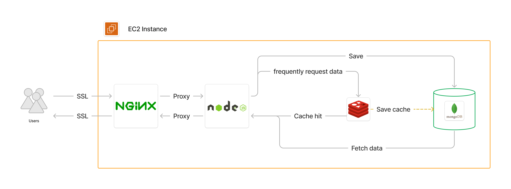
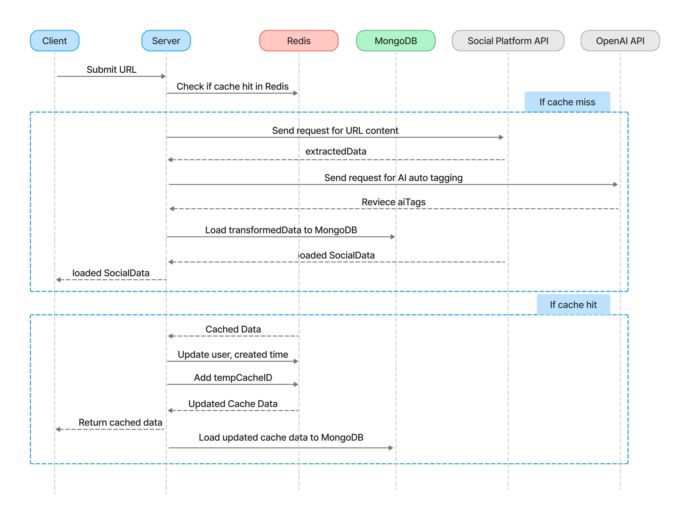
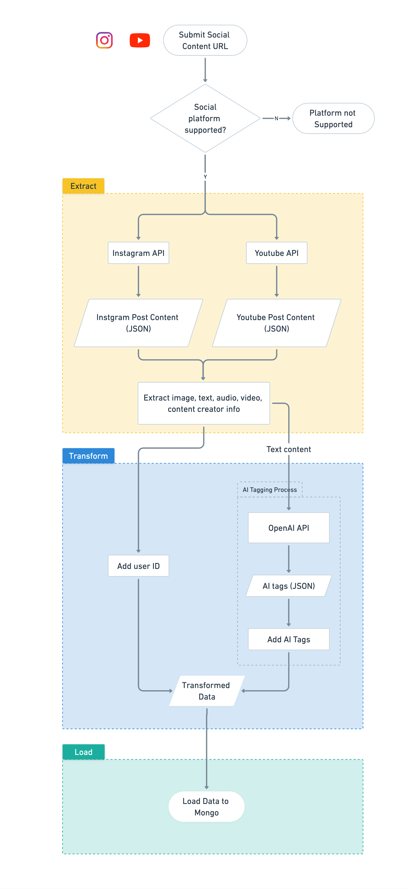
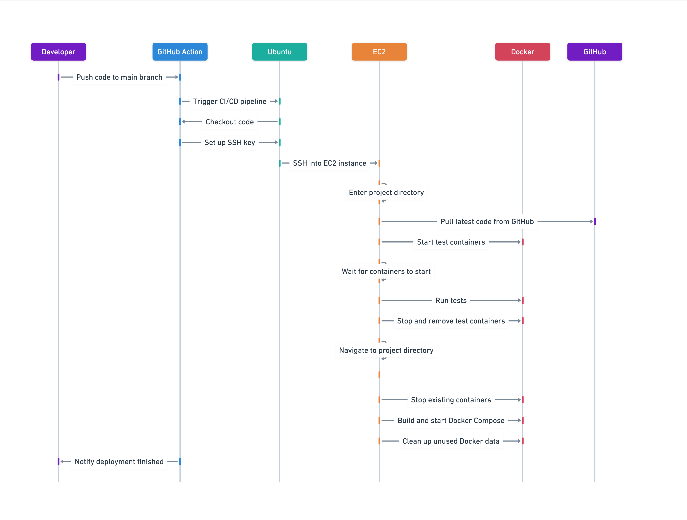
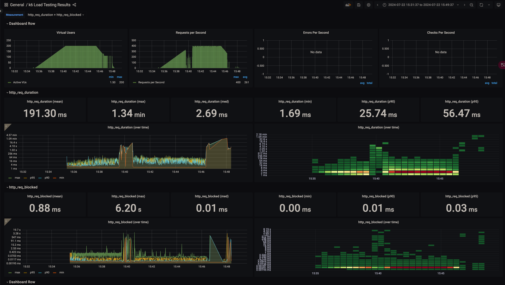
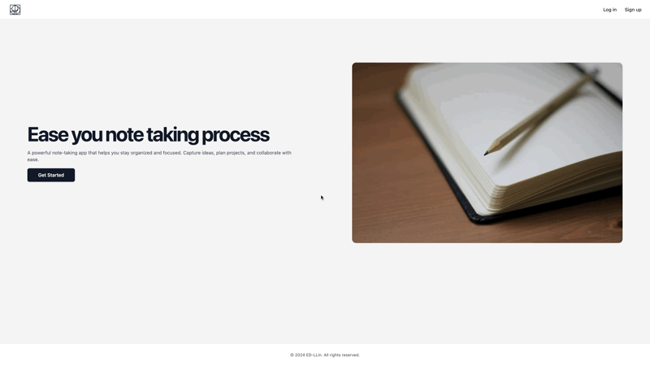
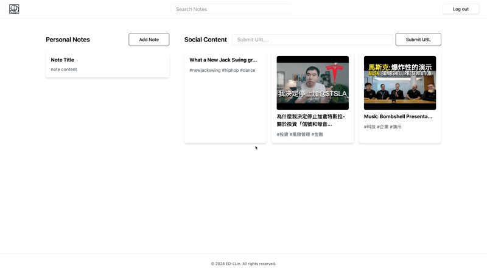

# Social Content Note with Auto AI tagging

A note-taking application that allows users to store and manage social media data efficiently with AI.

You can now visit the application at [notion-clone.com](https://notion-clone.com)


## Table of contents
- [Language and Tools](#language-and-tools)
- [Techniques](#techniques)
- [Features Demo](#features-demo)
- [Requirements](#requirements)
- [API Documentation](#api-documentation)


## Language and Tools
[](https://skillicons.dev)

- Backend
    - Node.js
    - Express.js
    - method-override

- Frontend
    - EJS
    - TailwindCSS

- Infrastructure
    - AWS EC2
    - NGINX
    - Docker, Docker Compose

- Database
    - MongoDB
    - Mongoose
    - Redis

- Authentication
    - Passport.js
    - express-session
    - MongoStore

- Configuration
    - dotenv

- APIs
    - Rapid API
    - OpenAI API

- Tests
    - Unit Test: jest
    - Load Test: k6, influxDB, Grafana

## Techniques
### 💡 Brief Architecture

### 💡 Sequence diagram of fetching content through URL

### 💡 Social Content ETL Process

### 💡 CI/CD Process


## Test Results
### 💡 Social Content Fetcher Controller Unit Test Result

The unit tests for the `fetcherController` utilize Jest to ensure the robustness and reliability of the code. Here are some key points:
- **Mock Functions**: Use `jest.mock` to mock database models and dependencies.
- **Mock Redis Client**: Dynamically mock `redisClient` and its methods.
- **Mock Mongoose**: Mock `ObjectId.isValid` method to check ObjectId validity.
- **Testing Different Scenarios**: Write multiple test cases for each controller method.
- **Simulating HTTP Requests and Responses**: Use `req` and `res` objects to simulate HTTP requests and responses.

#### Test Coverage Report

The following table provides an overview of the test coverage for the project:


File                   | % Stmts | % Branch | % Funcs | % Lines | Uncovered Line #s 
-----------------------|---------|----------|---------|---------|-------------------
All files              |   95.45 |    97.43 |      80 |   95.45 |                   
 controllers           |   99.31 |    97.43 |     100 |   99.31 |                   
  fetcherController.js |   99.31 |    97.43 |     100 |   99.31 | 74                
 etl                   |   23.07 |      100 |       0 |   23.07 |                   
  load.js              |   23.07 |      100 |       0 |   23.07 | 4-13              
 models                |     100 |      100 |     100 |     100 |                   
  SocialData.js        |     100 |      100 |     100 |     100 |                   
  User.js              |     100 |      100 |     100 |     100 |                   


### Insights and Recommendations from Test Coverage

- **Overall Coverage**: High coverage with 95.45% statements, 97.43% branches, 80% functions, and 95.45% lines.
- **Controllers**: Excellent coverage in `fetcherController.js` with 99.31% statements, 97.43% branches, 100% functions, and 99.31% lines; only line 74 uncovered.
- **ETL**: Low coverage in `etl/load.js` with 23.07% statements and lines; all branches covered, no functions tested, lines 4-13 uncovered.
- **Models**: Perfect coverage in `SocialData.js` and `User.js` with 100% statements, branches, functions, and lines.

**Future Improvements**:
- Improve ETL tests by increasing coverage for `etl/load.js`, ensuring all functions are tested, and addressing lines 4-13.
- Add a test case to cover line 74 in `fetcherController.js` for more coverage in Controller.

### 💡 K6 Load Testing Results

#### Test Configuration

We performed a k6 load test on the root route ("/") to assess the application's performance. The test setup included:

- **Duration**: 13 minutes
- **Virtual Users (VUs)**: Up to 200 VUs
- **Stages**:
  1. Ramp up to 40 VUs over 1 minute
  2. Increase to 80 VUs over 1 minute
  3. Increase to 120 VUs over 1 minute
  4. Increase to 160 VUs over 1 minute
  5. Increase to 200 VUs over 1 minute
  6. Maintain 200 VUs for 5 minutes
  7. Ramp down to 0 VUs over 3 minutes

- **Performance Threshold**: 95% of requests must complete within 500ms

#### Test Results


#### Key Metrics
- Virtual Users: Gradually increased to 200 and maintained for 5 minutes.
- Requests per Second: Peaked at approximately 261 requests per second.
- HTTP Request Duration:
    - Mean: 191.30 ms
	- Max: 1.34 minutes
	- Median: 2.69 ms
	- 90th Percentile: 25.74 ms
	- 95th Percentile: 56.47 ms
- HTTP Request Blocked Duration:
	- Mean: 0.88 ms
	- Max: 6.20 seconds
	- Median: 0.01 ms
	- 90th Percentile: 0.01 ms
	- 95th Percentile: 0.03 ms

#### Challenges Encountered
During the load testing, we encountered several issues:
- **Flush Operation Delays**: The flush operation to InfluxDB took longer than the expected interval, suggesting that the setup or configuration needs adjustment to handle the load sustainably.
   ```
   The flush operation took higher than the expected set push interval. If you see this message multiple times then the setup or configuration need to be adjusted to achieve a sustainable rate.`
    ```
#### To Be Improved
Based on the test results and challenges encountered, the following improvements are recommended:
- **Enhance Infrastructure**:
  - Scale the infrastructure to handle higher loads, including increasing the capacity of the database and server instances.
  - Fine-tune the configuration of InfluxDB to ensure it can handle the data ingestion rate without delays.
- **Adjust Data Push Configuration**:
    -  Modify the k6 configuration to reduce the frequency of data pushes or increase the buffer size to avoid data loss during high load periods.

## Features Demo
### 1. GoogleAuth

### 2. Fetch Social Content And Auto AI Tagging

Currently, the application supports fetching content from Instagram and YouTube.
### 3. Add Personal Note


## Requirements
- Node.js >= 14.0.0
- MongoDB

## Installation
1. Clone the repository:
   ```sh
   git clone https://github.com/yourusername/notion-clone-project.git
   cd notion-clone-project
   ```

2. Install dependencies:
   ```sh
   npm install
   ```

3. Create a `.env` file in the root directory and add the following:
   ```env
    PORT=3000
    MONGODB_URI=
    GOOGLE_CLIENT_ID=
    GOOGLE_CALLBACK_URL=http://localhost:3000/google/callback
    SESSION_SECRET=
    REDIS_URL=redis://localhost:6379
    x_rapidapi_key=
    OPENAI_API_KEY=
   ```


## API Documentation
This project includes Swagger API documentation. To access the API docs, navigate to [notionclone.com/api-docs](http://notionclone.com/api-docs) in your browser. The documentation provides detailed information on user authentication, note management, and search functionalities.